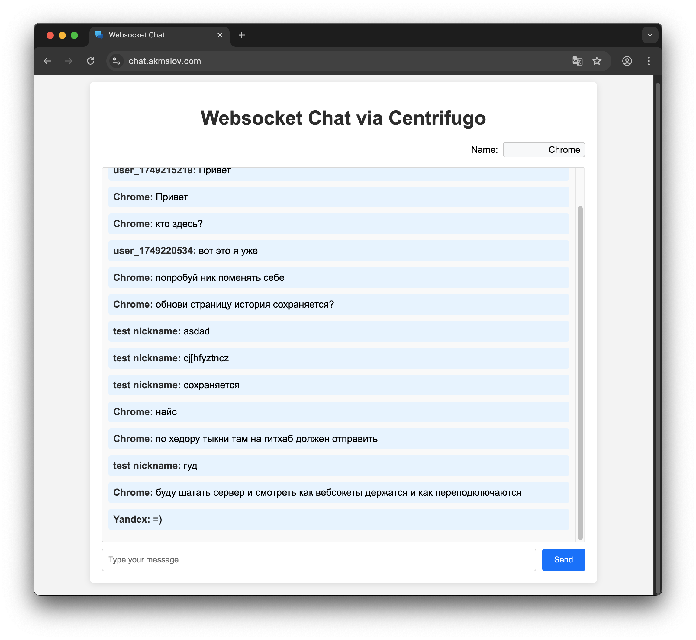

# centrifugo-ws-chat

Learning centrifugo websocket

- Front - Jinja template
- Back - Python FastAPI
- WebSocket Server - [centrifugo](https://github.com/centrifugal/centrifugo)



Run dev container
```sh
docker-compose -f dev_compose.yaml up -d
docker-compose -f dev_compose.yaml ps
docker-compose -f dev_compose.yaml logs
```


Admin UI method publish
```json
{
  "user_id": "test",
  "text": "text"
}
```


### Other projects examples:
- https://github.com/centrifugal/examples/blob/master/v6/leaderboard/backend/app.py
- ...


### TO DO:
- database (message history)
- redis (consumers)
- add scheme

